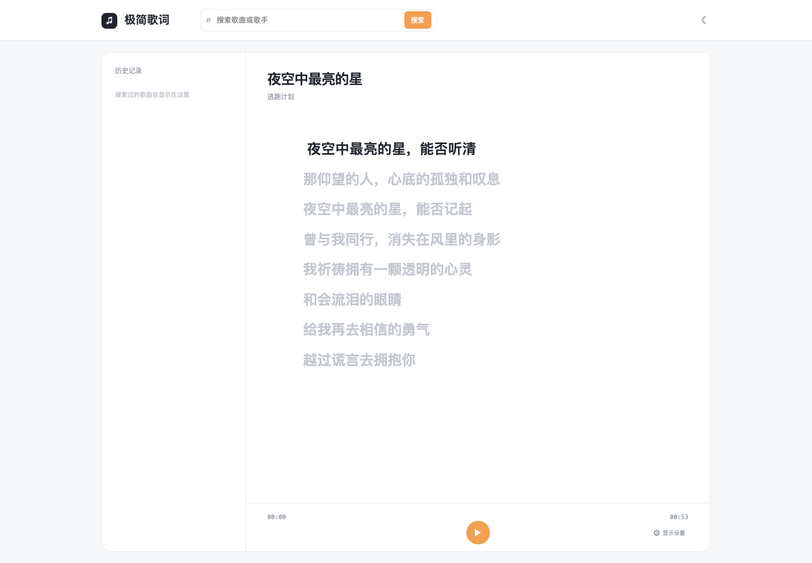

# 极简歌词

一个为手机分屏和专注阅读设计的纯文本歌词 Web 应用。它把歌词从复杂播放器中抽离出来，只保留搜索、阅读和同步播放需要的功能。

## 预览

### 桌面端



### 移动端


## 功能介绍

### 歌词搜索

- 支持按歌曲名或歌手搜索歌词
- 使用 LRCLIB 公开歌词服务
- 搜索结果展示歌曲名和歌手，点击即可载入
- 网络请求失败时保留当前页面，不影响本地示例歌词使用

### 歌词阅读

- 大字号纯文本歌词展示
- 当前歌词自动强调
- 点击任意歌词可以跳转到对应时间
- 歌词区域独立滚动，移动端不会拖动整个页面
- 支持手机分屏和窄屏阅读

### KTV 风格同步

- 点击播放按钮后，歌词按照 LRC 时间戳自动滚动
- 支持标准 LRC 逐行时间戳
- 支持 Enhanced LRC / Karaoke LRC 的逐字或逐词时间戳
- 有逐字时间数据时，按字词独立高亮
- 没有逐字时间数据时，使用平滑的近似高亮效果

### 历史记录

- 搜索过的歌曲自动加入历史记录
- 桌面端显示在左侧栏
- 移动端通过播放按钮旁的“历史记录”按钮从底部打开
- 仅保存歌曲 ID、名称和歌手，不保存歌词正文
- 最多保留 20 条记录，刷新后可自动恢复

### 显示设置

- 主题色和高亮颜色可自定义
- 内置金黄色、青蓝色、玫红色、荧光绿和紫色预设
- 支持调色板自定义颜色
- 支持字体大小和行间距调整
- 支持简繁转换：简体、繁体、不转换
- 支持浅色模式、黑暗模式和跟随系统
- 移动端支持纯歌词沉浸模式，只保留显示界面和播放/暂停两个悬浮按钮
- 支持恢复默认设置

## 技术说明

- Vite
- 原生 JavaScript、HTML、CSS
- `opencc-js`：简繁转换
- LRCLIB：标准歌词搜索与时间轴数据
- Enhanced LRC：逐字/逐词高亮数据格式
- `localStorage`：保存历史记录和显示设置

## 本地运行

```bash
npm install
npm run dev
```

默认开发地址：

```text
http://localhost:5175
```

如果 5175 已被占用，Vite 会自动使用下一个可用端口。

## 构建

```bash
npm run build
```

## GitHub 自动部署

仓库已包含 GitHub Actions 工作流。每次向 `main` 分支推送代码后，Actions 会自动安装依赖、构建项目并部署到当前 Cloudflare Pages 项目。

在 GitHub 仓库的 `Settings > Secrets and variables > Actions` 中添加以下两个 Repository secrets：

```text
CLOUDFLARE_ACCOUNT_ID=f2ded0908be6a36e06857d42019b8811
CLOUDFLARE_API_TOKEN=你的 Cloudflare API Token
```

API Token 至少需要 Cloudflare Pages 的编辑权限。添加完成后，可以在 `Actions` 页面手动运行工作流，或直接推送新的提交触发部署。

## 目录结构

```text
.
├── index.html
├── src/
│   ├── main.js
│   └── style.css
├── docs/screenshots/
│   ├── desktop.png
│   └── mobile.png
└── package.json
```

## 说明

歌词内容来自互联网公开服务，仅供个人学习和使用。当前项目提供歌词时间轴模拟播放，不包含歌曲音频文件或在线伴奏播放功能。
